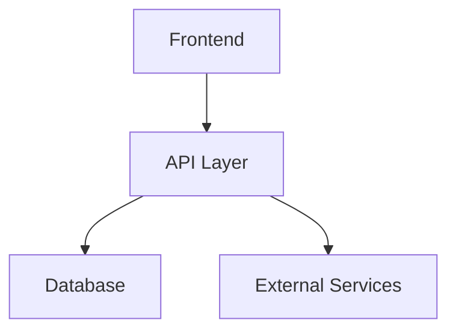

<div class="flex flex-col items-center w-full my-8">
    
    <a 
        href="https://link-to-project.com" 
        class="mt-2 text-sm text-blue-300 hover:text-blue-400 italic"
        target="_blank" 
        rel="noopener noreferrer"
    >
        View project →
    </a>
</div>

> **TL;DR:** A quick one-paragraph summary of your project that highlights the key features and technologies used. This helps readers quickly understand what they're about to read.

## 🎯 Project Overview

Brief project description goes here. One or two sentences about what this project is. You can use **bold** for emphasis and *italics* for technical terms or important concepts.

### 🔑 Key Features

1. **Feature One**: Detailed explanation with example
   ```javascript
   // Example code showing the feature
   const featureDemo = () => {
     const result = someFunction();
     return result.transform();
   };
   ```

2. **Feature Two**: Another key feature explanation
   ```python
   # Python example
   def feature_demo():
       result = some_function()
       return result.transform()
   ```

## 🛠️ Technical Implementation

### Architecture Overview



### Code Samples

Here's how we implemented the core functionality:

```typescript
interface ProjectConfig {
  name: string;
  version: string;
}

class ProjectManager {
  private config: ProjectConfig;
  
  constructor(config: ProjectConfig) {
    this.config = config;
  }
  
  public initialize(): void {
    console.log(`Initializing ${this.config.name} v${this.config.version}`);
  }
}
```

### Performance Metrics

| Metric | Before | After | Improvement |
|--------|---------|---------|-------------|
| Load Time | 2.5s | 0.8s | 68% ↓ |
| Bundle Size | 1.2MB | 450KB | 62.5% ↓ |
| API Latency | 800ms | 200ms | 75% ↓ |

## 💡 Tips and Tricks

> **Pro Tip:** These callout blocks can be used to highlight important information or warnings.

Here's a helpful debugging snippet:
```bash
# Debug command
DEBUG=app:* npm start
```

### Common Pitfalls

⚠️ **Warning:** Be careful with these common issues:

1. Issue One
   ```diff
   - const badCode = new BadPractice();
   + const goodCode = new BestPractice();
   ```

2. Issue Two
   ```shell
   # Fix for common error
   $ npm cache clean --force
   ```

## 🧪 Testing

Example test case:

```jest
describe('ProjectManager', () => {
  it('should initialize correctly', () => {
    const manager = new ProjectManager({
      name: 'Test Project',
      version: '1.0.0'
    });
    expect(manager.initialize()).toBeTruthy();
  });
});
```

## 📚 Resources

* [Documentation](https://docs.example.com)
* [API Reference](https://api.example.com)
* [Contributing Guide](./CONTRIBUTING.md)

---

<details>
<summary>📋 Deployment Checklist</summary>

- [ ] Update version number
- [ ] Run tests
- [ ] Build production bundle
- [ ] Deploy to staging
- [ ] Verify in production

</details>

---

*Last updated: YYYY-MM-DD*

[View the project →](https://link-to-project.com)

<div class="flex justify-center space-x-4 my-8">
    <a href="https://github.com/username/project" class="text-blue-300 hover:text-blue-400">
        GitHub
    </a>
    <span>•</span>
    <a href="https://demo.project.com" class="text-blue-300 hover:text-blue-400">
        Live Demo
    </a>
    <span>•</span>
    <a href="https://twitter.com/share" class="text-blue-300 hover:text-blue-400">
        Share
    </a>
</div>